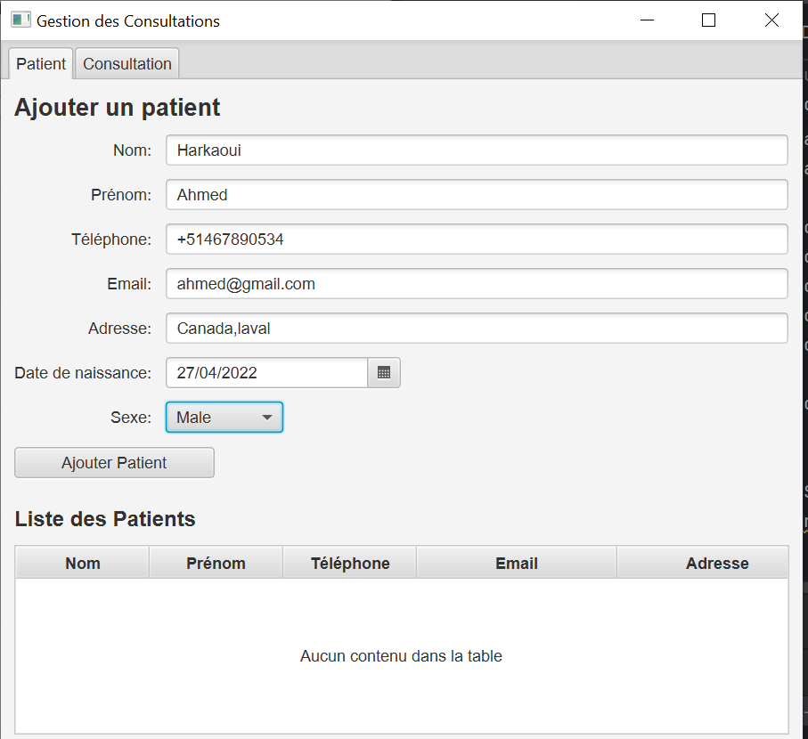
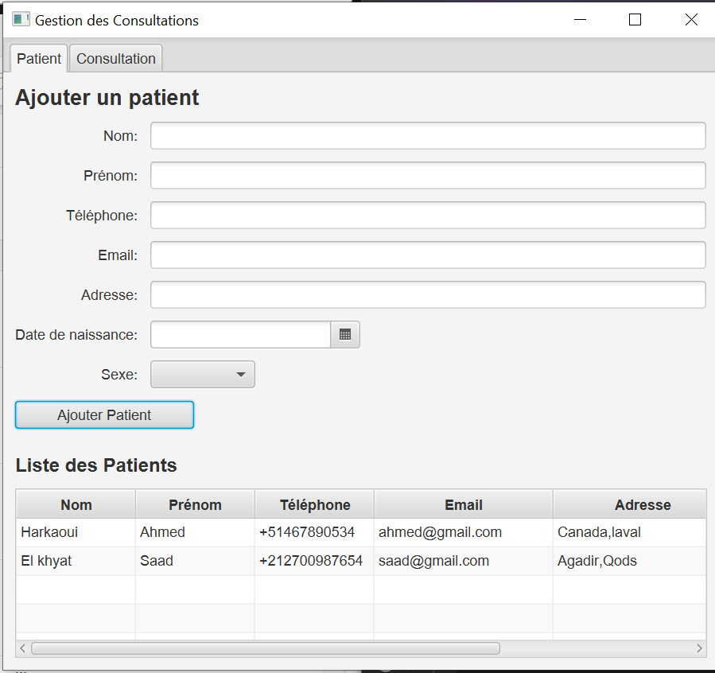
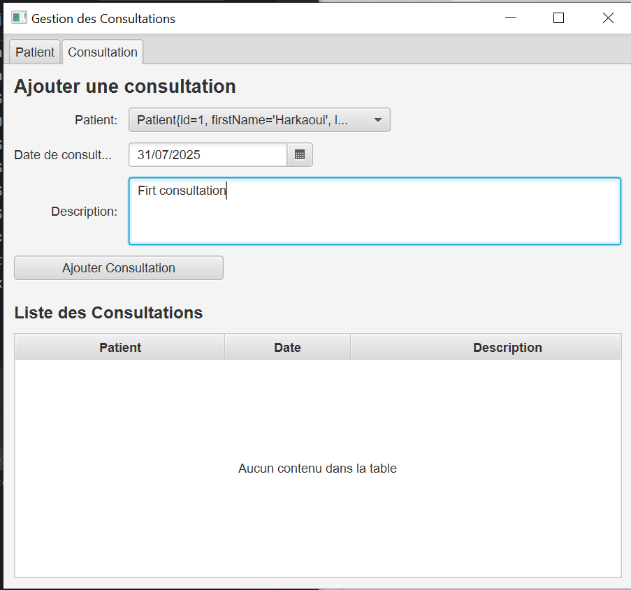
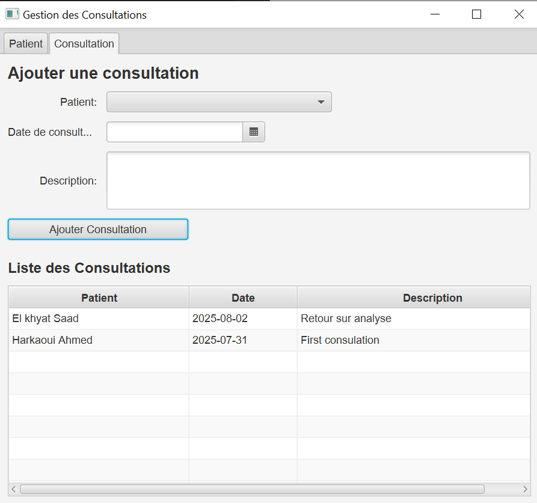
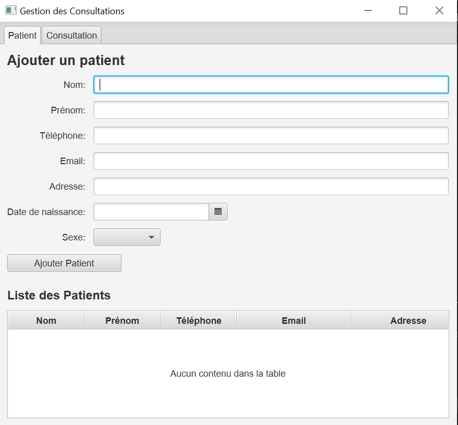

# 🩺 Application JavaFX : Gestion des Consultations Médicales

Ce projet est une application de bureau développée en **JavaFX (Java 1.8/17)** permettant la **gestion des patients** et **consultations médicales**. Elle utilise **MySQL** pour le stockage des données.

---

## ✅ Fonctionnalités principales

- Ajouter un patient
- Lister les patients enregistrés
- Ajouter une consultation pour un patient
- Lister les consultations
- Navigation via des onglets
- Connexion à une base de données MySQL (`db_cabinet`)

---

## 🖼️ Aperçu de l'application

### 🧍 Ajouter un patient


### 📋 Liste des patients


### ➕ Ajouter une consultation


### 📄 Liste des consultations


### 🏠 Page principale


---

## ⚙️ Technologies utilisées

- Java 1.8 / 17
- JavaFX 1.8+ (FXML)
- JDBC + MySQL
- IntelliJ IDEA
- Maven (pour la gestion des dépendances)
- ControlsFX

---

## 🗃️ Base de données : `db_cabinet`

**Tables :**
- `patient` (`id_patient`, `first_name`, `last_name`, `date_of_birth`, `gender`, `phone_number`, `email`, `address`)
- `consultation` (`id_consultation`, `date_consultation`, `description`, `patient_id`)

⚠️ Assurez-vous que le nom de colonne dans la DAO correspond bien à `id_patient` et non `id`.

---

## 🚀 Lancer l'application

1. Cloner le dépôt :
   ```bash
   git clone https://github.com/hajargithub/GestionConsultations.git
